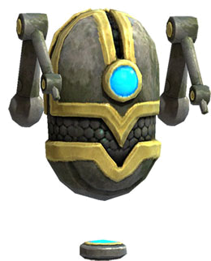

# Dedup-o-tron

Find duplicates across your inventories and bank tabs that you could stack.

- App
  - https://github.com/maael/dedupotron
  - https://dedupotron.mael.tech

## Features

- 🏦 Lets you see your bank and character inventories in one view
- 🕵️‍♂️ Lets you see duplicates that can be stacked by highlighting them, you can click items to see them more easily

## Install

```sh
git@github.com:maael/dedupotron.git
cd dedupotron
yarn
```

I used `node@10.21.0` to develop it.
