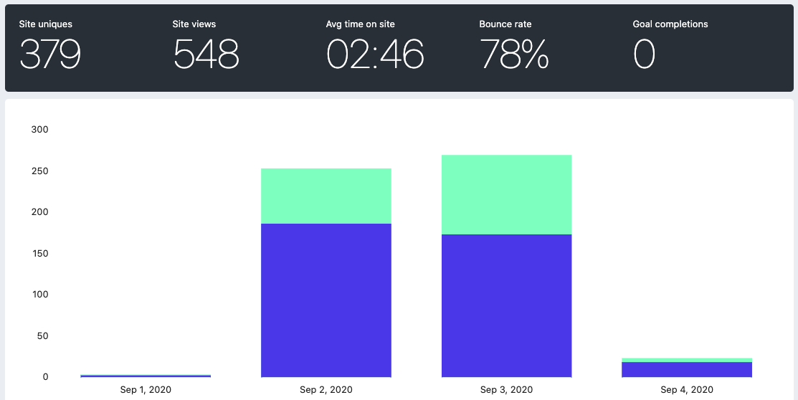

<p align="center">
  <a href="https://dedupe.mael.tech">
    
    <h3 align="center">Dedupe-o-Tron</h3>
  </a>
  <p align="center">Dedupe all the things.</p>
</p>

# :robot:⠀Dedupe-o-tron

A tool for [Guild Wars 2](https://www.guildwars2.com/) that lets you find duplicates across your inventories and bank tabs (and guild stashes if you want) that you could stack.

- :octocat:⠀https://github.com/maael/dedupotron
- :hammer_and_wrench:⠀https://dedupe.mael.tech

## Features

- :bank:⠀Lets you see your bank, your guild stashes, and character inventories in one view
- :detective:⠀Lets you see duplicates that can be stacked by highlighting them, you can click items to highlight them to see them more easily
- :heavy_plus_sign:⠀Lets you maximise/minimise any section, so you choose what to see

## Release

The release post announcing the tool can be found [here on Reddit](https://www.reddit.com/r/Guildwars2/comments/il9fjb/dedupeotron_find_duplicate_items_in_your_bank_and/).

Here's what the initial analytics looked like (taken on the morning of the 4th):

<p align="center">
  
</p>

## Tech

- [React](https://reactjs.org/)
- [TypeScript](https://www.typescriptlang.org/)
- [Next JS](https://nextjs.org/)
- Deployed on [Vercel](vercel.com)
- Uses [Fathom Analytics](https://usefathom.com/) for privacy-focused analytics

## Install

```sh
git@github.com:maael/dedupotron.git
cd dedupotron
yarn
```

I used `node@10.21.0` to develop it.
